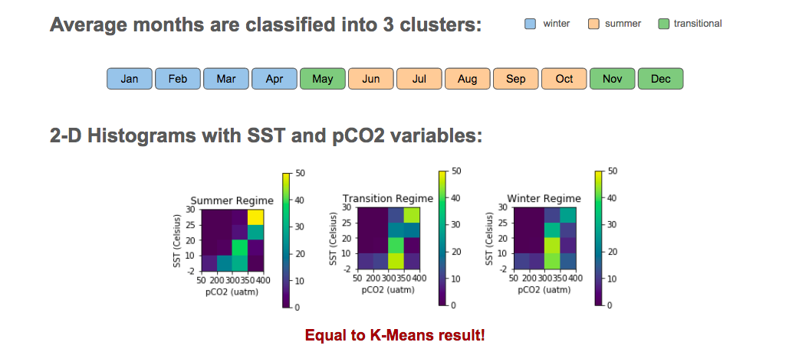
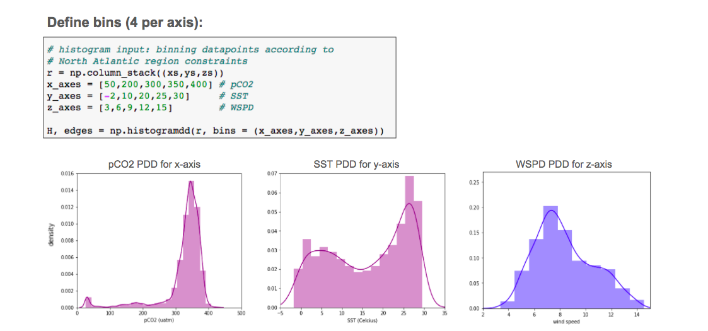

# NASA Goddard Institute for Space Studies, Fall 2017

* Intern: Moorissa Tjokro (moorissa.tjokro@columbia.edu)
* Advisor: Anastasia Romanou (anastasia.romanou@columbia.edu)

## Dataset
Dataset used for this research project is a clean version of `12-month Ocean Carbon States (OCS)` dataset, which can be found in the `Data` folder.

For further information: https://data.giss.nasa.gov/oceans/carbonstates/

## Research Questions

1. Can we explore other pattern recognition techniques, ie. clustering, for classifying ocean carbon regimes based on geophysical data such as pCO2 and SST?

2. Can we cluster regimes using more than two variables, in addition to pCO2 and SST?

## Methodology

## Part 1: 2-D Clustering

### Classification Input

### 1. K-Means Clustering

### 2. Agglomerative / Hierarchical Clustering

### 3. Expectation-Maximization (EM) Clustering

## Part 2: 3-D Clustering

### Classification Input

### 1. Per-bin Classification

### 2. All-bins classification

### 3. Scatterplots as an alternative to histograms

## Conclusion

### 2-D Clustering

With 2-D k-means clustering, we achieved three regimes with observations as follows.
Winter regime with four months: January, February, March, and April.
Transition regime with three months: May, November, and December.
Summer regime with five months: June, July, August, September, and October.
Summer regime has the highest frequency in high temperature and concentrations of pCO2, indicated by yellow color in the top right bin (in SST of 25-30 Celcius and pCO2 of 350-400 uatm). Transition regime has less frequency in this same bin with high SST and pCO2, followed by winter with the least number of datapoints. This makes sense because low temperature and pCO2 would indicate winter season.

All three regimes interestingly have relatively high frequency in moderate SST between 10 and 20 Celsius and pCO2 of 300-350 uatm. In the lowest SST between -2 and 10 Celsius with the same pCO2 bin, we have both transition and winter regimes classify more temporal data points, which is indicative of higher frequency.

### 3-D clustering

Our clustering process involves 3-dimensional data, namely partial pressures of carbon dioxides (pCO2), sea surface temperature (pCO2), and wind speed (WSPD), where we develop two algorithms in classifying winter, transition, and summer regimes:

Per-bin classification: We segment the 4x4x4 dataset to 4 bins of 4x4 (pCO2 and SST) by wind speed (WSPD). For each bin, we cluster the 12-month 4x4 arrays into three different clusters: summer, transition, and winter regimes.

All-bins classification: We take the 4x4x4 data containing 4 bins of pCO2, 4 bins of SST, and 4 bins of WSPD (binning details in Figure 4) and run a single k-means cluster. The result of winter, transition, and summer regimes is then segmented into 4 bins.

For 3-D clustering, we added wind speed (WSPD) as the third variable. Comparing the regimes result above with that of per-bin classification, there are more data points in wind speed between 6 and 9 m/s than other bins across all three regimes are.

Winter regime is attributable to higher wind speed (any data points with WSPD above 6m/s), while summer regime is attributable to lower wind speed (those with WSPD below 9m/s). The transition regime is attributable to all wind speed but mostly 6-12m/s, in particular high SST and pCO2 bin (25-30 Celsius and 350-400 uatm) for 6-9m/s and lower SST and moderate pCO2 (-2-20 Celsius and 300-350 uatm).

Summer regime has the highest frequency in high SST and high pCO2 (25-30 Celsius and 350-400 uatm), yet has the lowest wind speed range (3-6 m/s). This pattern is followed by transition then winter regime. Meanwhile, in the highest wind speed range (12-15 m/s), winter has the most frequency or data points with low SST and high pCO2, followed by transition then summer regime. This result indicates a higher/faster wind speed can be attributed to winter regime wind speed while lower wind speed is attributable to summer regime.

Interestingly, clustering all bins together yields a similar result to clustering each bin individually for four times (since we have four groups of wind speed).

A major difference is that in the low wind speed range (3-6 m/s), the bin with high SST and pCO2 (25-30 Celsius and 350-400 uatm) is not plotted as bright/yellow as per-bin classification. This is because the cluster is ran on all dataset rather than per wind speed range. Although there are also slight difference than per-bin classification result, the pattern still looks consistent and carries the same insight.
